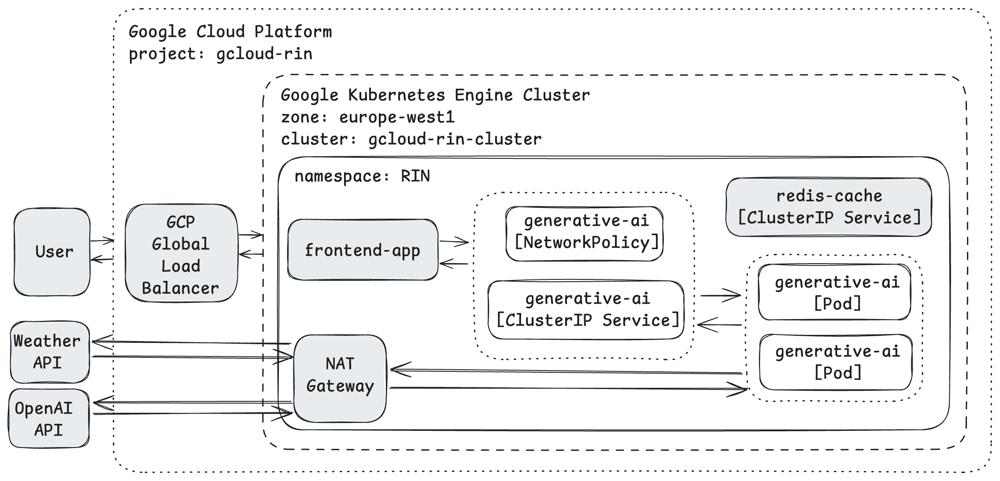

# Overview

This project provides a platform for generating personalized, weather-based content in various styles and languages.

Project includes the following key technical aspects:

- **Web Development**: How to build a back-end web application using the MVC pattern and the FastAPI.


- **3-rd Party API Integration**: Integrating external APIs such as the WeatherAPI and OpenAI API.


- **Application Dockerization**: How to containerize the web application using Docker and push an image to GHCR.


- **CI CD pipeline**: How to use the GitHub Actions, including steps for static analysis, automated testing, building, and deployment.

Path
```
https://github.com/NikoletaKocurovaAI/artificial-intelligence/blob/main/.github/workflows/generative_ai.yml
```

- **Kubernetes Deployment**: How to deploy the app to GCP GKE using ClusterIP.

Path
```
https://github.com/NikoletaKocurovaAI/artificial-intelligence/tree/main/deploy/generative_ai
```

# System Context Diagram


# DEV Set-up

```
uvicorn run_app:app --reload
```

# Dependency management tool

```
virtualenv venv_genai
```

```
source venv_genai/bin/activate
```
